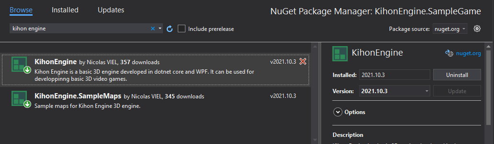

# Getting Started
 
Create a video game based on Kihon Engine is very easy.

You can take a look inside the sample project `KihonEngine.SampleGame` . 

Or create a .NET 5 WPF application by following this short tutorial.

## Create a sample application

Begin by creating a .NET 5 WPF application


Add Kihon Engine Nuget packages to the project



Open `MainWindow.xaml` and add some buttons like this:

```xml
<Window x:Class="KihonEngine.SampleGame.MainWindow"
        xmlns="http://schemas.microsoft.com/winfx/2006/xaml/presentation"
        xmlns:x="http://schemas.microsoft.com/winfx/2006/xaml"
        xmlns:d="http://schemas.microsoft.com/expression/blend/2008"
        xmlns:mc="http://schemas.openxmlformats.org/markup-compatibility/2006"
        mc:Ignorable="d"
        Title="Kihon Engine - Sample Game" 
        ResizeMode="NoResize" Height="350" Width="480" WindowStartupLocation="CenterScreen">
<Canvas>
        <Label x:Name="lblTitle" Content="Dark Castle Sample Game" 
               Canvas.Left="92" Canvas.Top="30" FontSize="24"/>
        <Button x:Name="btnStart" Content="Start Game" 
                Canvas.Left="175" Canvas.Top="120" Height="50" Width="129" />
        <Button x:Name="btnExit" Content="Exit" 
                Canvas.Left="175" Canvas.Top="220" Height="50" Width="129"/>
        <Label x:Name="lblPoweredBy" Content="Powered by Kihon Engine" 
               Canvas.Right="5" Canvas.Bottom="5" FontSize="8"/>
    </Canvas>
</Window>
```

And the whole `MainWindow.xaml.cs` should look something like this:

```csharp
namespace KihonEngine.SampleGame
{
    using System.Windows;
    using System.Windows.Input;

    public partial class MainWindow : Window
    {
        public MainWindow()
        {
            InitializeComponent();

            // Step 1 : Configure game engine
            StandardStartups.BuildStandaloneFullScreenGame();

            // Step 2 : Precise were your textures and skyboxes are located (with KihonEngine 2021.10.17 or upper)
            Engine.RegisterContentFromAssembly(typeof(KihonEngine.SampleMaps.DarkCastleM2MapBuilder));

            // Step 3 : When click Start button, launch game
            btnStart.Click += (sender, e) => Engine.Play<KihonEngine.SampleMaps.DarkCastleM2MapBuilder>();

            // And then, manage how application ends
            btnExit.Click += (sender, e) => Close();

            KeyDown += (sender, e) => { if (e.Key == Key.Escape) { Close(); } };
        }
    }
}
```

And that's all. 

## Execute the sample application

When the application starts, you will have basic a startup screen. 


And by click Start Game, you will launch one of the few sample maps available in `KihonEngine.SampleMaps` nuget package


Go back to [ documentation home page](../README.md)