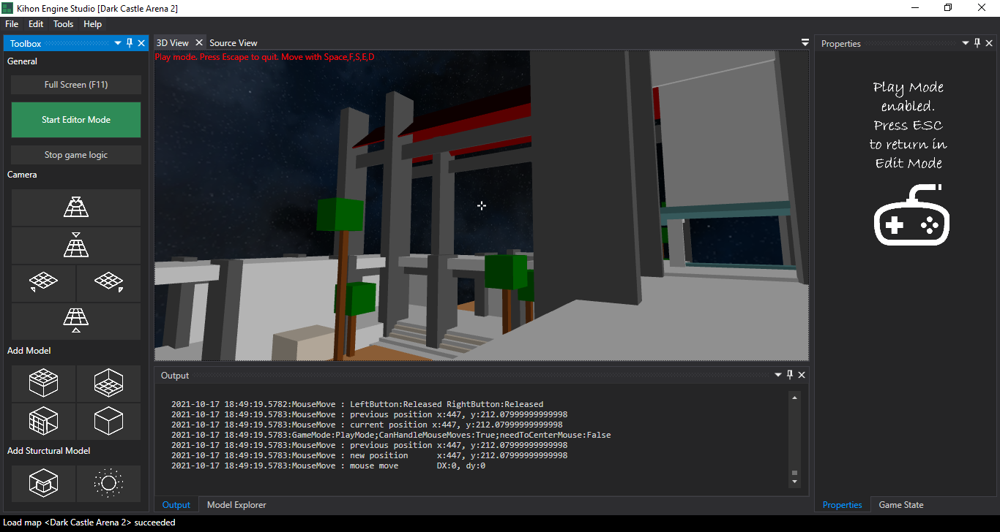

# Kihon Engine Studio

Kihon Engine Studio helps for building maps

The actual basic features are the following

Some generic features 
* Save and load maps from files based on a json format
* Possibility to change map global properties like map name, respawn player camera (position and direction)
* Source viewer for the currently edited map, in order to visualize the json format
* Game state viewer to analyse game state at any time
* Possibility to switch between edit mode and game mode in order to vizualise how map is rendered at play time

## Texture support
You can now create maps using your own textures and skyboxes. 

### Manage content sources
Use the content source manager in `Tools > Manage Content Sources...`. 

A Content Source scans the following subfolders:
* textures : for locating textures
* skyboxes : for locating skyboxes

By defaut, the following content source are available.

| Sources | Description |
| ----------| ------------| 
| Embedded resources of KihonEngine | Contains skybox 1 and very few textures
| Embedded resources of KihonEngine.SampleMaps |Contains some textures from Quake3 file `PAK0.PK3`. And contains few skyboxes 
| Folder `Content/Images` of execution directory | you can put some files here if you want

You can add the following content sources
| Sources types | Description |
| ----------| ------------| 
| Zip files or PK3 files | only subfolders `textures` and `syboxes` will be scanned
| Folder | only subfolders `textures` and `syboxes` will be scanned

### Extract content of current map
You can extract textures and skyboxes used in current map by using `File > Save Map Content As...`

### Register your content source in your game source code
`KihonEngine.Engine` provides the following methods to register your custom content source at startup:

| Methods | Description |
| ----------| ------------| 
| RegisterContentFromAssembly | Register embedded content of a custom assemlby
| RegisterContentFromFolder | Register content from a directory
| RegisterContentFromFile | Register content from a Zip file, or a PK3 file

## Maze generator
The maze generator available in `File > New > Maze...` can be used as a starter for quickly create maps

## Play mode
Play mode allows to test the map directly into the editor, in order to verify if gameplay is as expected

## Edit mode
Edit mode is the default mode of the editor

### Adding 3D models to maps

Diferent kind of 3D models can be added to a map

| Mode type | Description |
| ----------| ------------| 
| Floor     | 
| Ceiling   | 
| Wall      | 
| Volume    | Like cube, rectangles 
| Light     | To make the viewport3D scene visible
| Skyboxe   | Actually, four predefined skyboxes are availables

### Possibility to edit the 3D models
* By dimentions
* By colors
* As proof of concept, actually only four textures are available for floors

### Possibility to move 3D models on the map
* By rotation on axis X, Y and Z
* By translation on axis X, Y and Z

Go back to [ documentation home page](../README.md)