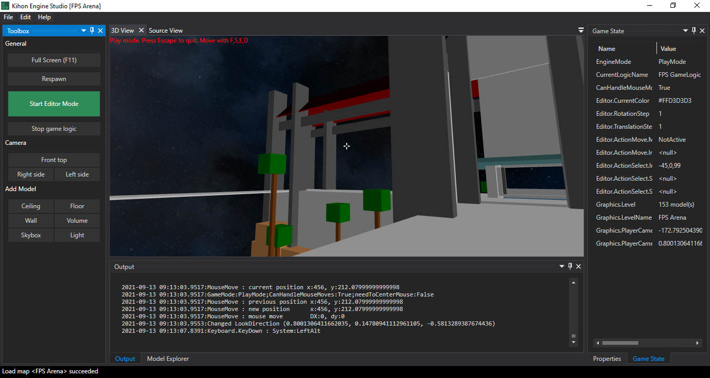
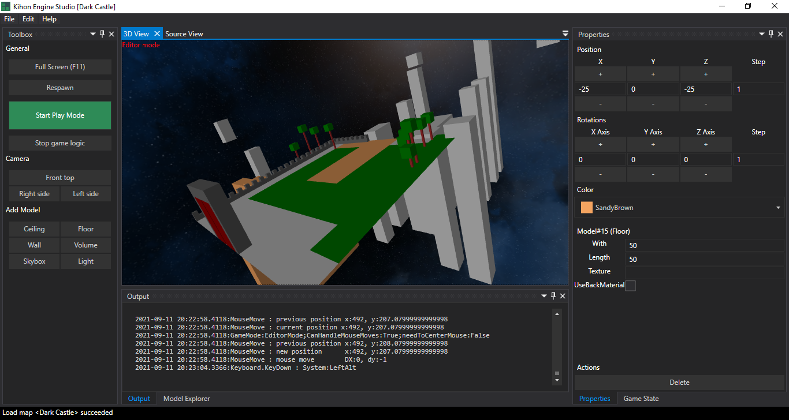
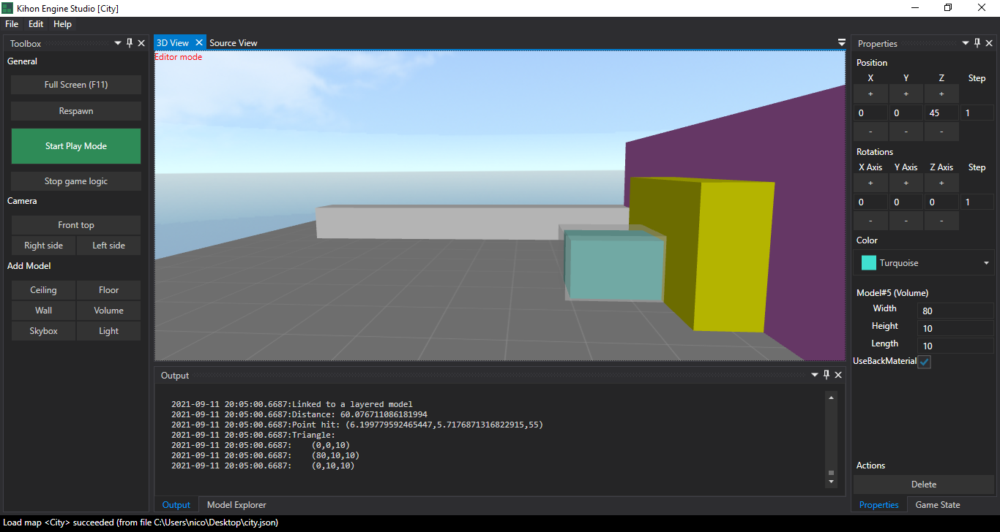
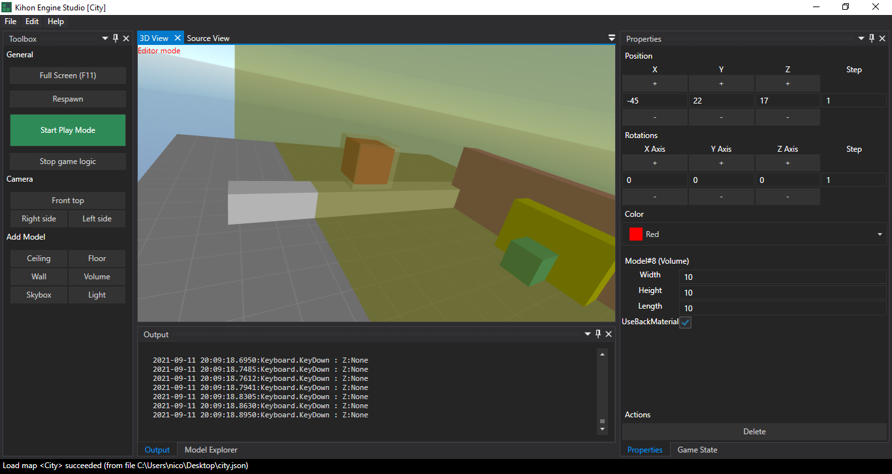

# Kihon Engine Studio

Kihon Engine Studio helps for building maps

The actual basic features are the following

Some generic features 
* Save and load maps from files based on a json format
* Possibility to change map global properties like map name, respawn player camera (position and direction)
* Source viewer for the currently edited map, in order to visualize the json format
* Game state viewer to analyse game state at any time
* Possibility to switch between edit mode and game mode in order to vizualise how map is rendered at play time

## Maze generator
The maze generator available in `File > New maze` can be used as a started for quickly create maps

## Play mode
Play mode allow to play on the map directly into the editor, in order to test the gameplay

## Edit mode
Edit mode is the default mode of the editor

### Adding 3D models to maps
* Add floor
* Add ceilings
* Add walls
* Add volumes, like cube, rectangles
* Add lights to make the viewport3D scene visible
* Add skyboxes. Actually, three predefined skyboxes are availables

### Possibility to edit the 3D models
* By dimentions
* By colors
* As proof of concept, actually only four textures are available for floors

### Possibility to move 3D models on the map
* By rotation on axis X, Y and Z
* By translation on axis X, Y and Z

Go back to [ documentation home page](../README.md)